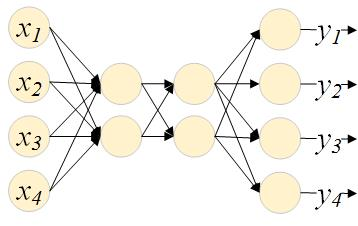
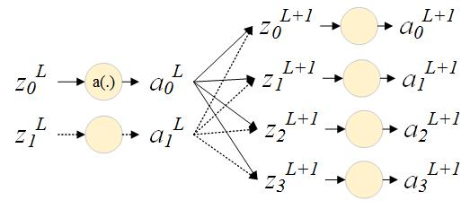

## Feed-Forward NN

神经网络的研究和应用自上世纪四十年代以来，经历起起伏伏，到今天迎来了又一次春天。随着硬件能力的提升和可获取数据量的增加，神经网络正在打破语音识别、图像识别、自然语言处理等不同领域各自的最佳算法实践，已经或者有望成为解决多类问题的通用算法。Feed-Forward Neuron Network作为神经网络中最基础、最经典的一种，是了解神经网络的一个好起点。

### Model

神经网络的基本单位是神经元（neuron），它对输入做线性加权，再应用激活函数（activation function）$a(x)$后输出:$y=a(z)=a(wx+b)$。

单个神经元本身就可以看作一个LR模型，已经可以很好地建模线性可分问题。而通过叠加、组合多个神经单元，可以构成更为复杂的Feed-Forward NN，进而建模更加复杂的非线性问题。

从左至右，第一层为输入层，这一层是单纯的输入示意，不做任何运算；中间两层为隐藏层，最后一层为输出层。

**激活函数**

常用的激活函数包括sigmod和tanh函数。他们共同的性质是对称、有界且倒数对称、有界。

在输出层，有时会应用另外一个激活函数：softmax函数。输出层应用一个softmax函数将$z^L$转换为一个概率分布向量：

$$y_j^L=\frac{e^{z_j^L}}{\sum\limits_k e^{z_k^L}}$$

选择sigmoid还是softmax作为输出层的激活函数，需要视具体问题而定。如果多个输出不是互斥的，例如，在预测用户属性时，一个输出是性别，另一个输出是是否患病，使用sigmoid更加自然。如果多个输出之间互斥，例如，手写体识别中，每个输出分表代表一个数字，则softmax是更合适的选择。

### Train with Backpropagation

模型的训练涉及两个基本问题：代价函数定义，以及参数最优化。

**代价函数：cross entropy**

常用的代价函数有均方误差和cross entropy。对于常用的sigmod和tanh激活函数，均方误差代价函数会导致[梯度下降缓慢(learning slowdown)](http://neuralnetworksanddeeplearning.com/chap3.html#the_cross-entropy_cost_function)，不如softmax常用，不再话下。

cross entropy作为代价函数定义如下：

$$C=D(a^L,y)=-\frac{1}{n}\sum\limits_x\sum\limits_j y_j\log a_j^L$$

**参数最优化：SGD by Backpropagation**

神经网络的训练常用SGD，NN的网络结构使得参数梯度求解有一个很棒的优化算法，称为后向传播算法（Backpropagation）。它利用求导链式法则，大幅降低了梯度求解的时间复杂度。

BP算法的第一个要点是巧妙地递推各层中$C$关于$z$的梯度。

$$\frac{\partial C}{\partial z_j^l}=\sum\limits_k\frac{\partial C}{z_k^{l+1}}\frac{\partial z_k^{l+1}}{z_j^l}
=\sum\limits_k\frac{\partial z_k^{l+1}}{z_j^l}\cdot\frac{\partial C}{z_k^{l+1}}
=\sum\limits_k w_{kj}^{l+1}\sigma'(z_j^l)\frac{\partial C}{z_k^{l+1}}$$

使用矩阵表示则为：

$$\frac{\partial C}{\partial z^L}=(\frac{\partial C}{\partial a^L})\frac{\partial \sigma(z^L)}{\partial z^L}$$

$$\frac{\partial C}{\partial z^l}=((W^{l+1})^T\frac{\partial C}{\partial z^{l+1}})\sigma'(z^l)$$

可见，每一层中$C$关于$z$的梯度可以由后一层的梯度递推而来，即误差（梯度）“从后向前层层传播”，故名Backpropagation。

BP算法的第二个要点是以$C$关于$z$的梯度为桥梁，求解$C$关于网络参数$W$和$b$的梯度：

$$\frac{\partial C}{\partial b_j^l}=\frac{\partial C}{\partial z_j^l}$$

$$\frac{\partial C}{\partial W_{jk}^l}={a_k^{l-1}}\frac{\partial C}{\partial {z_j^l}}$$

BP之于神经网络就像FFT之于数字信号处理，是训练所有神经网络模型的基础。

### Example : mnist手写数字识别

MNIST是一个手写字符图像数据集，其中有60000训练样本，10000个测试样本。图像大小为28×28像素，像素值处于0到255之间的整数，其中，0代表黑色，255代表白色，灰度值可以通过除以255来得到。

很多论文中会将60000个训练样本分为两份：50000个样本作训练集，10000个样本作验证集（用于选择超参数，例如学习率和模型大小），我们接下来会遵循这一习惯。

用Feedforward NN来解决识别问题，输入层和输出层的维度并不难确定。问题的输入是28x28像素的灰度图像，输入层的大小即为784=28x28，每个输入是一个[0,1]的灰度值；问题的输出是0-9中的一个，输出层大小即为10，每个输出代表对答案为该数字的一种“度量”。隐藏层的维度和层数则要凭经验而定，这里，我们选择一个隐藏层，大小为15。

完整代码见[Feedforward.py](./feedforward.py)。BP作为整个[训练算法](./Feedforward.py)的核心，实现上仅需要几次矩阵运算。

    def backprop(self, x, y):
        """Return a tuple ``(dcdb, dcdw)`` representing the
        gradient for the cost function C_x in each layer"""
        dcdb = [np.zeros(b.shape) for b in self.biases]
        dcdw = [np.zeros(w.shape) for w in self.weights]
        # forward pass
        activation = x
        activations = [x] # list to store all the activations, layer by layer
        zs = [] # list to store all the z vectors, layer by layer
        for i, (b, w) in enumerate(zip(self.biases, self.weights)):
            z = np.dot(w, activation) + b
            zs.append(z)
            if(i == len(self.biases) - 1):
                activation = softmax(z)
            else:
                activation = sigmoid(z)
            activations.append(activation)
        # backward pass
        dcdz = (self.cost).delta(activations[-1], y)
        dcdb[-1] = dcdz
        dcdw[-1] = np.dot(dcdz, activations[-2].transpose())
        for l in xrange(2, self.num_layers):
            z = zs[-l]
            sp = sigmoid_prime(z)
            dcdz = np.dot(self.weights[-l+1].transpose(), dcdz) * sp
            dcdb[-l] = dcdz
            dcdw[-l] = np.dot(dcdz, activations[-l-1].transpose())
        return (dcdb, dcdw)

经过30次迭代，这样一个简单的实现，在validation set上已经达到了97%左右的准确率。

    Epoch 29 training complete
    Cost on training data: 0.0794132821371
    Accuracy on training data: 48922 / 50000
    Cost on evaluation data: 0.389545105544
    Accuracy on evaluation data: 9695 / 10000
