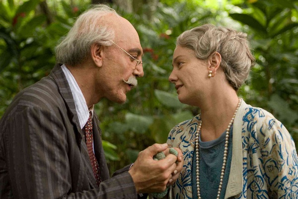

## 十分钟亵读《霍乱时期的爱情》

乌比尔诺医生刚从法国学成归来，便动用全新的有力手段，制止了省里最后一次霍乱的流行，由此赢得了政府的嘉奖，以及人民的爱戴。但他不是个只混迹于上流社会酒会的俗咖，比如他就这么结识了一位穷摄影师：他们下了几把象棋，就冥冥中觉得他懂他，他也懂他。男人之间的友谊，就这么简简单单。

一天早上六点钟，摄影师玩了个把戏，他在自家门外留了个字条：请进，无需敲门。巡夜人看到之后，叫来了警察。警察推开门，看到的是摄影师一丝不挂地死在床上。医生得知消息立马到了现场，他盯着尸体看了一会后，移步旁边一盘尚未下完的棋局。一股悲伤还在酝酿，警察打断了他：

“桌上的纸堆里有封给你的信。”

医生看完信之后什么也没说，坐着马车去了一个住所。这地方很偏，房子也没有门牌号，车夫扣了扣门环，门就悄无声息地开了，昏暗处站着一个妇人：

“没想到你这么快就来了”。

这妇人是摄影师的情妇。医生崩溃了：我天天和你下棋、聊天，还赞助你的摄影事业，你却有个这么多年的情妇我竟完全不知道。就算你没死，咱俩的友谊今天一样玩完。

妇人比摄影师来这里晚一年左右，只是短期拜访摄影师。女人还不是说变就变，她永远地留下了。摄影师的死，妇人早就知晓。很多年前，他们在一片荒凉的沙滩上面对面滚啊滚的时候，摄影师就告诉她，他有一个永远不会变老的简单方法，就是在自己六十岁老的不能再爱的时候，杀死自己。医生黯然神伤，挚友的离去让他第一次感到死亡如此真切。

医生住在港湾边的富人区，家里的妻子有恋宠物癖。她在家里几乎开了一家动物园。一天，其中一只德国獒得了狂犬病，扑倒了很多动物，医生一怒之下下令扑杀整个园子，并对妻子放下狠话：

“以后凡是不会说话的，一律不准进这个家。”

他一辈子混着这么开却还不懂女人的智慧，妻子没过多久就买来了一只皇家鹦鹉。不过男人的话很多时候也是放屁，鹦鹉整天叫唤的也挺可爱，医生渐渐喜欢上了它。

医生天天和鹦鹉玩耍地很开心，忘了帮它剪羽毛。鹦鹉抓住机会飞到树梢挑衅，医生动用了全家的资源，还请来了消防队也没能制服鹦鹉。以医生的年纪，忘掉这只鹦鹉只要分分钟，没几天他就真忘了。可是鹦鹉不干了，不能就这么玩完，它又飞回来放了几枪。医生听到马上恢复了斗志。按理讲，他五六十年婚姻生活到今天早该明白自己力不从心了，但是他不服，作死地爬梯子去抓鹦鹉。作了当然就得死，他在空中悬留了片刻，来不及领受圣体，来不及为任何事忏悔，来不及向任何人告别，死在神圣降临节的星期日下午四点零七分。连摄影师的葬礼都还没参加，他就迫不及待地去见摄影师了。

在医生的葬礼上，男二号来了：一生默默等待医生妻子的痴心男。一年过了一年，一生只为这一天，他一上台就甩给医生妻子一句惊天动地的誓言：

“这个机会我已经等了半个多世纪，就是为了再一次向您重申我对您永恒的忠诚和不渝的爱情。相信我，我们种树，我们努力，我们还有希望......”

意思是，只要你愿意，咱们婚礼和葬礼一起办，就在今天。但是，就算女主内心再怎样翻滚，在她丈夫尸骨未寒的时候被告白，一定感觉不会很棒：

“你滚吧，有生之年，别再见。”

她把门一把甩在他脸上，倒床边睡边哭。她发现此刻她想的最多的竟然是痴心男，不是刚刚离去的丈夫。有趣！

女主和痴心男显然不是葬礼上一见钟情的。早在女主还是富家小姐的时候，痴心男就盯上了她。他频繁给她写信，还故意在她窗前的公园里晃。“你在公园看风景，看风景的人在窗边看你”。小姐，可懂？

痴心男的母亲也是位伟大的理论家。她鼓励儿子，弱者永远都无法进入爱情真正的王国，因为那是一个严肃、吝啬的国度，女人只会对意志坚强的男人俯首称臣，因为只有这样的男人才能带给她们安全感。儿子，加油！

每一段不合时宜的早恋总有一个严厉的父亲，情书被女主的父亲发现了。他断然要求他们断绝交往，并告诉女儿，她这个年龄的爱情不过是海市蜃楼，望她退回那些情书。要说大人们的虚伪有什么不同，就是他们还都挺冠冕堂皇，他明明就是觉得痴心男配不上他女儿。要知道女主父亲当年追求她母亲的时候也曾被她们家嫌弃，而她母亲义无反顾要嫁给他，现在他反倒还信誓旦旦地和当年反对自己婚事的小舅子们倾诉自己女儿的不幸遭遇，玩的一手只许州官放火，不准百姓点灯。

时间是唯一的解药，父亲带着女儿去长途旅行。可是万万没想到，刚回家，又被痴心男盯上了。那天，女主上街无拘无束地玩耍，一会晃荡进肮脏的情书代写市场，一会淹没在嘈乱的叫卖市场，痴心男一路尾随，见这一幕幕和他整天脑补的剧情不一样，他不高兴了：

“这可不是你该来的地方！”

女主听后很失望，同样表示信里的他也不是这样，干劲利落的回了封信：

今天，见到您时，我发现我们之间不过是一场幻觉。

从此，痴心男再也没有机会单独见女主。在他们漫长的一生的几次相遇中，他再也没有单独和她说过话，直到五十一年九个月零四天后，她成为寡妇的第一个晚上，他再一次向她重申自己对她永恒的忠诚和不渝的爱情。

女主和医生是有缘分的。医生二十八岁时几乎是所有女人眼中理想的交配对象。直到有一天，他的另一位医生朋友认为在一个十八岁的富家小姐身上有疑似霍乱的症状，请求医生前去看看。诊断结果是，不过是一次肠道感染。确认目标安全之后，他表白了：

“您就像一朵初开的玫瑰。”

别管肤浅不肤浅，女主答应了。谈不上很心动，但是他完美啊，所有人都说好，重要的是女主的父亲也非常满意。要说哪里有些不爽，就是只要父亲满意的，她就应该表现出一些不爽，以示反抗。

当痴心男得知女主即将嫁给一位门第显赫、家财万贯、在欧洲受过教育而且在同龄人中声誉非比寻常的医生时，没有任何力量能让他从消沉中振作起来。有时，他甚至会用邪恶的信念来安慰自己：在醉人的婚礼中，甚至在火热的蜜月里，女主脑海里哪怕只有那么片刻浮现出他这个被嘲弄、被侮辱、被唾弃的影子，她的幸福不就戛然而止了么？哦耶，开心！

没过多久，痴心男在大教堂的庭院里看见怀孕六个月、俨然一派上流社会太太模样的女主，下了坚定不移的决心，争取名气和财富，以便在医生无可避免地死去时，无愧于得到她。

医生有钱有势，痴心男有叔叔。他来到叔叔的航运公司请求给他这个浪子侄儿一份差事。叔叔任命他为总经理室抄写员。无奈他写任何东西都感情奔放，把正式文件写得跟情书似的。叔叔终于忍无可忍，给他下了最后通谋：

“要是你没本事写出一封象样的商业信函，那你就到码头上扫垃圾去吧。”

“我唯一感兴趣的是爱情。”他陶醉地回答。

漫长的等待过程中，痴心男不是铁板一块。他开始偷偷猎取女人。先是跟一位遗孀做了一阵露水夫妻，打开了寻花觅柳的道路。随后几年中，继续干着勾搭夜间无主小鸟的勾当，幻想借此来减轻失去女主的痛苦。到了后来，已经说不清他绝望地发泄淫欲的习惯，到底是出于心理的需要，还是一种生理上的恶习了。

灯谜赛会上，他又认识了一位妹妹。在他们水乳交融那个时候，他扪心自问：哪种状态才是所谓的爱情，到底是在那张巨大的床上呢，还是在礼拜日宁静的公园？好妹妹以一个浅显的理由让他心安理得：不穿衣服所做的事情都是爱情。不过后来，他和好妹妹还是决裂了，对女主的思念才又苏醒过来。

成功是总结出来的。一生中接触的许许多多寡妇，从那位遗孀开始，使他懂得，结过婚的女人在丈夫亡故之后是何等幸福。没有理由认为女主会和其他寡妇有什么不同，来自死神的豁免，会让她们重获爱情，一次出污泥而不染的爱情。

婚姻生活平静而漫长，医生也玩“是男人，就出轨”，而他的妻子也借此秀出了女人智商新高度。一个倒霉的星期天，女主闻了闻丈夫头一天下午穿过的衣服，只一嗅便成功嗅出了一位小三。生活教男人说谎，也叫女人坚强。明察秋毫的妻子没有大吵大闹，而是一声不吭地打冷战牌，医生最终败北，和盘托出。他和她是四个月前结识的，在狂热的胡言乱语中，他什么都允诺，可是事后，一切又留待以后再说了。出于谨慎，医生每次都速战速决，绝不超过一次静脉注射的时间。败露之后，医生下定决心（他也只能下定决心）和小三断绝来往。永远爱她的许诺，单独为她找一所僻静的住所使他能泰然与她偷情的幻想，恩爱的、至死不渝的誓言等等，都永远结束了。他勇敢地作出这一决定是多么的痛苦，只有上帝知道！

有志者，事竟成。医生逝世一年之后，痴心男按照计划，继承了他叔叔的公司，成为航运公司的一号人物。他开始频繁地拜访女主，女主也开始渐渐忘却丈夫，愉快地和他在一起了。

一次造访中，他向她发出邀请，请她乘船沿河做一次休息性旅行。七月七日的下午六点钟，女主登上痴心男公司的轮船，和他一起过七夕。他们谈各自不同的生活，谈赤裸裸地躺在黑布隆冬的船房里令人难以置信的偶然性，谈她从来没有听说过他有女人。痴心男一听便立即给出正确答案，声音中没有一丝颤抖：

“那是因为我为你保留着童贞。”

在丈夫死后这么短的时间内就这么浪漫，女主有点怕被熟人发现。痴心男想想点办法让她不是像坐牢一样，总是呆在舱房里。于是他告诉船长挂上霍乱旗帜，在港口合理合法地赶下所有乘客。为了伟大的爱情，他们愉快地这么干了。

在一艘空船上，他们没日没夜，滚得船里船外，浪花朵朵开。终于，累了，决定靠岸。港口巡警见到这是艘有人感染霍乱的船只，拒绝他们靠岸，要求隔离他们，后续搞不好要暗地里灭杀他们。痴心男此时灵感又来了：

“我们启航，返回出发港。”

“见鬼，那您认为我们这样来来回回的究竟要走到什么时候？”船长问。

早在五十三年七个月零十一个日日夜夜之前，他就准备好了答案：

“如果非要加上一个期限，我希望是一万年......” #姚明的微笑#
