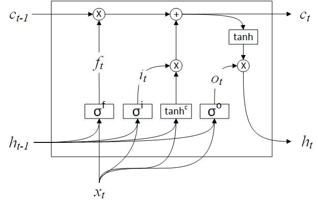

## Long Short-Term Memory(LSTM)

为解决RNN中的Gradient Vanishing问题，Hochreiter和Jürgen Schmidhuber在1997年提出了一个RNN的变种：[LSTM(Long Short-Term Memory)](http://deeplearning.cs.cmu.edu/pdfs/Hochreiter97_lstm.pdf)。

### Model

经典的RNN网络通过隐藏层的状态$$h_t$$学习和记录上下文信息，LSTM本质上在做同样的事情，唯一的区别是它采用了另一种能够避免Gadient Vanishing的方法。

LSTM在通常的隐藏状态$$h_t$$之外引入一个额外的内部记忆(internal memory)$$c_t$$，以及围绕它运算的三个门结构：input gate，forgeet gate，output gate。Google的Chris Olah有一篇很棒的[博客](http://colah.github.io/posts/2015-08-Understanding-LSTMs/)给出了LSTM网络结构的示意图。

$$
i_t=\sigma(U^ix_t+W^is_{t-1}),
f_t=\sigma(U^fx_t+W^fs_{t-1}),
o_t=\sigma(U^ox_t+W^os_{t-1})
$$

$$
\hat{c_t}=\tanh(U^cx_t+W^cs_{t-1}),
c_t=f_t \circ c_{t-1} + i_t \circ \hat{c_t}
$$

$$
h_t=o_t\circ\tanh(c_t)
$$

**gates**

$$i,f,o$$分别称为input gate、forget gate和output gate。他们都是以当前时刻的$$x_t$$和上一时刻的$$h_{t-1}$$为输入，操作也完全相同，只是有各自独立的网络参数$$W$$和$$U$$。

$$\hat{c_t}=\tanh(U^cx_t+W^ch_{t-1})$$类似RNN中更新的隐层状态$$h_t$$，但在LSTM中，它仅仅是一个候选隐层状态，**input gate将最终控制$$\hat{c_t}$$有多少应该保留到$$c_t$$中进行记忆**。在RNN中，input gate等价于使用为全1。

**forget gate控制了上一个时刻的内部记忆$$c_{t-1}$$有多少应该被忘掉**。

并不是所有的记忆都应该暴露为本时刻的隐层状态$$h_t$$，供网络中的其它单元使用。**output gate控制了当前时刻的内部记忆$$c_t$$有多少应该被输出**，成为本层的$$h_t$$，进而被其它网络单元使用，例如计算当前时刻output的输出层。

**internal memory**

$$c_t$$是LSTM的核心部分，它的更新包括两个部分：

 * 对上一时刻$$c_{t-1}$$的选择性遗忘。
 * 对当前候选输入$$\hat{c_t}$$的选择性记忆。

如果去除选择性的门结构，例如选择遗忘所有上一时刻的记忆（$$f_t=0s$$），完全接受本时刻的输入（$$i_t=1s$$）并且全部输出（$$o_t=1s$$），则有：

$$
c_t=i_t=\sigma(Wh_{t-1}+Ux_t)
$$

$$
h_t=\tanh(c_t)
$$

除了多计算一层$$\tanh$$函数，LSTM即退化成了RNN。从这个角度来讲，经典的RNN是LSTM的一个特例。

### Variations on LSTM

LSTM有很多其它的网络结构变种，例如常见的peephole、GRU等。Greff在2015年对它们进行了[对比](http://arxiv.org/pdf/1503.04069.pdf)，大致的结论是它们性能类似，没有一个算法总是最优。

**peephole**

[peephole](http://www.jmlr.org/papers/volume3/gers02a/gers02a.pdf)由Gers & Schmidhuber在2000年提出。LSTM中，门结构$$o,f,i$$仅依赖上一时刻的$$h_{t-1}$$，peephole则额外引入了上一时刻的$$c_{t-1}$$作为gates的输入。

**GRU**

GRU(Gated Recurrent Unit)是另一种LSTM变种，由Cho, et al在2014年[提出](http://arxiv.org/pdf/1406.1078v3.pdf)，因其相对LSTM简单的网络结构而逐渐流行。

GRU在LSTM上做了诸多改动：

 * 用一个update gate $$z$$替代独立的forget gate $$f$$和input gate $$i$$。$$i,f$$变为互耦关系：$$i=z,f=1-z$$。
 * 去除了额外的记忆单元$$c_t$$，直接更新$$h_t$$，因此也没有output gate $$o$$。
 * 增加了reset gate $$r$$，用于选择性接受上一时刻的$$h_{t-1}$$。

GRU还比较年轻，到目前为止，虽然已有一些实验结果[[1]](http://arxiv.org/abs/1412.3555)[[2]](http://jmlr.org/proceedings/papers/v37/jozefowicz15.pdf)对LSTM和GRU进行比较，孰优孰劣还没有定论。GRU的网络参数少于LSTM，因此在训练速度方面占有，对数据量的需求也较LSTM稍低。

**Depth Gated RNNs**

由MSR的Yao在2014年[提出](http://arxiv.org/pdf/1508.03790v2.pdf)。

**Clockwork RNN**

由Koutnik在2014年[提出](http://arxiv.org/pdf/1402.3511v1.pdf)，它采用了一种完全不同于LSTM的方法来解决long-term dependency问题。

### Example: LSTM language model building

RNN的训练方法BPTT同样适用于LSTM，完整的代码见[lstm_theano.py](../rnn/lstm_theano.py)。对比[rnn_theano.py](../rnn/rnn_theano.py))，唯一的区别是forward propagation中的隐藏层操作。

    def forward_prop_step(x_t, s_t_prev, U, V, W):
        z_t = T.nnet.hard_sigmoid(U[0][:,x_t] + W[0].dot(s_t_prev))
        r_t = T.nnet.hard_sigmoid(U[1][:,x_t] + W[1].dot(s_t_prev))
        c_t = T.tanh(U[2][:,x_t] + W[2].dot(s_t_prev * r_t))
        s_t = (T.ones_like(z_t) - z_t) * c_t + z_t * s_t_prev

        o_t = T.nnet.softmax(V.dot(s_t))

        return [o_t[0], s_t]
