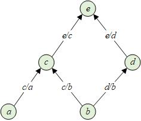

## back propagation

神经网络的训练本质上是一个参数的最优化问题，Back propagation(BP)算法在这个过程中起了至关重要的作用。它极大地降低了代价函数对参数的导数计算量。BP如果简单来说的话，其实可以简单：对求导的链式法则的有效利用。然而，体会其中的妙处还得仔细推算一遍。

### forward propagation

我们先暂时放下BP，借用Colah君的[一个例子](http://colah.github.io/posts/2015-08-Backprop/)，从Forward Propagation开始。假设变量\(a,b,c,d,e\)有如下的计算关系，我们要计算e对所有其它变量的导数。

\[c=a+b\]

\[d=b+1\]

\[e=c*d\]

下面的计算图表示了上述运过程，每一个节点代表一个变量，节点之间的边代表了变量之间的依赖和影响关系，边上的weight由偏导数定义。

导数可以理解为变量变化\(\Delta x\)，导致\(y\)的变化有多大，导数表示了变化速率。这样以来，上图中\(\partial e/\partial b\)可以通过累加所有从\(b\)到\(e\)的path得到，每条path的总weight由各段路径的weights乘积表示。

\[\frac{\partial e}{\partial b}=\frac{\partial e}{\partial c}\frac{\partial c}{\partial b}+\frac{\partial e}{\partial d}\frac{\partial d}{\partial b}\]

至此，我们的结论是：

**任意\(y\)关于\(x\)的偏导数，可以通过累加所有\(x\)影响\(y\)的路径得到。**

这就是forward propagation以及计算图表示清晰地展示给我们的，实际上也是对chain rule的一种直观理解。

### back propagation

在forward propagation中，为了计算\(e\)关于\(a,b,c,d\)的导数，需要我们分别以\(a,b,c,d\)为起点，最终走到\(e\)，计算图中的有些路径被重复走了很多次。避免这个问题的方法是从上往下计算，即从bottom-up模式转换为top-down。这样遍历计算图一次，就可以计算出所有\(e\)关于\(a,b,c,d\)的导数。

这种计算方法就是back propagation：仿佛变化量\(\Delta\)是从被影响变量反向传播到影响他们的变量上。所以，bp本质是一个降低整体求导复杂度的优化算法，之所以谈神经网络必谈bp，是因为nn的参数非常多，如果通过简单的forward方式计算梯度，会导致巨大的计算量。bp因此成为了nn优化的“标配”。

