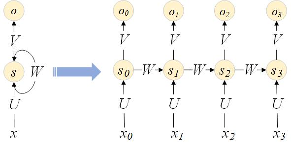

## Recurrent NN

在feedforward NN中，后一层仅依赖前一层的输出作为输入。有些类型的网络中包含反馈（feedback loop），RNN（Recurrent Neuron Network）就是其中一类，它的网络结构使得它可以自动捕捉输入序列的上下文信息，这种对序列信息的建模能力使得它在自然语言处理等领域得到了成功的应用。

### Model

RNN是一个三层结构：Input layer，中间recurrent layer和output layer，recurrent layer有一个“将输出引回输入的环”。RNN可以展开（unfold/unroll）为一个无环结构。给定一个长度为n的输入，RNN展开为n个输入时刻，每个时刻有一个输入和输出。简洁起见，我们用矩阵符号代替层与层之间的全连接线条。

展开后的RNN网络类似于传统的feedforward NN，区别有以下两点：

* 每层网络（对应RNN的每个时刻）的输入有两个:上一时刻的输出$$s_{t-1}$$和一个时刻$$t$$的输入$$x_t$$。
* 每层网络共享同一套参数$$U,V,W$$。模型参数相对减少了不少。

### Train with BPTT

在RNN的训练过程中，通常会使用一个叫做Backpropagation Through Time(BPTT)的算法来计算梯度。下面我们将看到，BPTT实际上是由于RNN特殊的网络结构而对BP所做的一个扩展。

网络参数$$V$$仅有$$s_t$$作为其输入，因此，$$C_t$$关于$$V$$的梯度计算比较简单：

$$
\frac{\partial C_t}{\partial V}=\frac{\partial C_t}{\partial y_t} \frac{\partial y_t}{\partial V}=(o_t - \hat{y_t}) \otimes s_t
$$

$$C_t$$关于$$U$$和$$W$$的梯度计算需要利用递推。参考BP，我们第一步选择$$\frac{\partial C_t}{\partial z_t}$$作为递推变量，有以下递推关系：

$$
\frac{\partial C_t}{\partial z_t}=\frac{\partial C_t}{\partial s_t}\frac{\partial s_t}{\partial z_t}=\frac{\partial C_t}{\partial y_t}\frac{\partial y_t}{\partial s_t}\frac{\partial s_t}{\partial z_t}=V^T(o_t - \hat{y_t}) a_t'(z)
$$

$$
\frac{\partial C_t}{\partial z_{t-1}}=\frac{\partial C_t}{\partial z_t} \frac{\partial z_t}{\partial z_{s-1}} \frac{\partial s_{t-1}}{\partial z_{t-1}}=W^T \frac{\partial C_t}{\partial z_t} a_{t-1}'(z)
$$

第二步，我们借助$$\frac{\partial C_t}{\partial z_t}$$，推导$$\frac{\partial C_t}{\partial U}$$和$$\frac{\partial C_t}{\partial W}$$：

$$
\frac{\partial C_t}{\partial W}=\frac{\partial C_t}{\partial z_t} \frac{\partial z_t}{\partial W}
$$

共享参数就是在这里制造了一点麻烦。$$z_t=Ux_t+Ws_{t-1}$$，其中$$s_{t-1}=a(z_{t-1})=a(Ux_{t-1}+Ws_{t-2})$$仍然以$$W$$为变量。BPTT就是为了解决这个问题对BP做了一点变化，$$\frac{\partial C_t}{\partial W}$$不再只依赖t时刻的$$\frac{\partial C_t}{\partial z_t}$$，而是依赖整个[1, t]时刻：

$$
\frac{\partial C_t}{\partial W}=\frac{\partial C_t}{\partial z_t} \frac{\partial z_t}{\partial W}=\sum\limits_1^t \frac{\partial C_t}{\partial z_t} s_{t-1
}$$

$$\frac{\partial C_t}{\partial U}$$和$$\frac{\partial C_t}{\partial W}$$一样存在类似问题，同样可推导得出：

$$
\frac{\partial C_t}{\partial U}=\frac{\partial C_t}{\partial z_t} \frac{\partial z_t}{\partial U}=\sum\limits_1^t \frac{\partial C_t}{\partial z_t} x_t
$$

可以看出，如果输入序列长度较长，梯度计算将需要后向传播很多层，训练时间会因此增加。实际实现上，通常会截断传播层数为k，即只对时间窗口[t-k, t]内的梯度进行累加。

**Unstable Gradient**

表面上看，RNN是一个理论上完美的模型，它可以自动捕捉、记忆上文信息。它在NLP领域也得到了很多成功的应用。然而，1991年Sepp Hochreiter[发现](http://people.idsia.ch/~juergen/fundamentaldeeplearningproblem.html)，RNN其实并不能捕捉相距很远的输出和输入之间的关联，对于需要很长上下文的任务，RNN不能很好地工作。造成这一现象的原因是[Gradient Vanishing](http://neuralnetworksanddeeplearning.com/chap5.html#what's_causing_the_vanishing_gradient_problem_unstable_gradients_in_deep_neural_nets)。

Gadient Vanishing问题导致的直观结果是时刻$$t$$的hidden state $$s_t$$难以影响相距较远的时刻t+k的$$s_{t+k}$$，这一点可以通过观察$$\partial s_{t+m}/\partial s_t$$来验证。

$$
\frac{\partial s_{t+k}}{\partial s_t}=\frac{\partial s_{t+k}}{\partial s_{t+k-1}} * \cdot\cdot\cdot * \frac{\partial s_{t+1}}{\partial s_{t}}=\left(a_{t+k}'(z_{t+k})W\right) * \cdot\cdot\cdot * \left(a_{t}'(z_t) * W\right)
$$

常用的sigmod和tanh的倒数取值在[0,1/4]之间，并且在$$\pm\infty$$处快速趋于0。而$$a'_t=a'(Ux_t+Ws_{t-1})$$以$$W$$为参数，想使得$$a'_t$$较大，$$|W|$$需要取一个接近于0的值；如果$$|W|$$较大，$$a'_t$$反而趋近于0。因此，$$|(a_{t}'(z_t) * W)|$$实际上通常小于1，多个这样的项相乘，会导致结果指数级下降，从而发生Gadient Vanishing。Gradient Vanishing并非针对RNN，在所有深度网络中都存在，导致深度网络难以训练。

Vanishing Gradient问题可以被缓解，例如合理地初始化W，增加regularization项，以及使用[ReLU](https://en.wikipedia.org/wiki/Rectifier_(neural_networks)作为激活函数。但要从根本上摆脱，需要另一种更加复杂的模型--LSTM。

### Add embedding

Using word embedding such as word2vec and GloVe is a popular method to improve the accuracy of your model. Instead of using one-hot vectors to represent our words, the low-dimensional vectors learned using word2vec or GloVe carry semantic meaning – similar words have similar vectors. Using these vectors is a form of pre-training. Intuitively, you are telling the network which words are similar so that it needs to learn less about the language. Using pre-trained vectors is particularly useful if you don’t have a lot of data because it allows the network to generalize to unseen words.

The embedding matrix is just a lookup table – the ith column vector corresponds to the ith word in our vocabulary. No matter whether you have a pre-trained embedding or not, adding an embedding layer makes the architecture more consistent:

  * Use fixed pre-trained embedding. During training, embedding matrix $$E$$ is constant and won't be updated.
  * Use pre-trained embedding as initial value. Initial matrixn $$E$$ with a good initialization, but still update it during training.
  * Learn embedding ourselves. If we don't have pre-trained embedding, by updating the matrix $$E$$, we are learning word vectors ourselves, but they are very specific to our data set and not as general as those that are trained on millions or billions of documents.

### Add auxiliary features

Until now, our input is purely the input sequence, no matter it is one-hot or word embedding. Sometimes, it is helpful to introduce more knowledge. Considering we are building a conversational bot. Before giving response, we want to predict the intent of the question. Let's take a look at the following two scenarios,

    Scenario I:
      What is the whether in Shanghai?  Intent: question_weather
      How about Hongkong?               Intent: question_weather

    Scenario II:
      Wonderful places in Shanghai      Intent: question_poi
      How about Hongkong?               Intent: question_poi

In order to predict the intent of the second question, the intent of previous question is good and necessary knowledge. Those knowledge is often referred as **auxiliary feature**. Introducing auxiliary feature is straightforward: just add another input to the hidden layer.

In detail, there will be an additional matrix in hidden state computation:

$$
s_t=a(Ws_{t-1}+Ux_t+Aau)
$$

In our conversational bot example, $$au$$ is a two dimension one-hot vector: each dimension is set if previous intent is that intent.

### Example: RNN language model building

语言模型（LM）是对一个语料库的统计建模，其用途十分广泛，例如，为机器翻译（MT）、语音识别（SR）等产出的候选集打分选出得分最高的结果。LM解决的核心问题是计算给定句子的概率，这一个概率用链式法则展开为：

$$
P(w_1,...w_k)=\prod\limits_{i=1}^{k}P(w_i|w_1,...,|w_i)
$$

传统n-gram语言模型的上下文长度n是有限的，认为窗口n以外的词不会对预测下一个词产生影响，上式得以简化：

$$
P(w_1,...w_k)=\prod\limits_{i=1}^{k}P(w_i|w_{i-n+1},...,|w_i)
$$

而RNN有能力建模很长的上下文，打破了n-gram在建模上的假设。

训练之前，我们先对训练预料做一些预处理，包括增加句首和句尾标记，用数字id编号文本单词等。LM的目标是给定输入预测下一个词，所以预期输出实际上就是输入向量向后移位一个词。例如，对于句子‘what are n't you understanding about this ? !’，输入、输出向量分别为：

    input:
    SENTENCE_START what are n't you understanding about this ? !
    [0, 51, 27, 16, 10, 856, 53, 25, 34, 69]

    output:
    what are n't you understanding about this ? ! SENTENCE_END
    [51, 27, 16, 10, 856, 53, 25, 34, 69, 1]

于是，RNN网络中各个变量的含义如下：

* $$x_t$$是当前时刻输入的word，表示为一个词表大小的one-hot vector，只有当前词对应的id位置值为1，其余全为0。
* $$s_t=a(z), z=Ux_t+Ws_{t-1}$$，为当前时刻的隐藏状态（hidden state），是一个向量，$$a(\cdot)$$通常取tanh或sigmoid等非线性激活函数。$$s_t$$可以看作是截至当前时刻$$t$$对所有输入的“总结”和“记忆”。
* $$o_t=\text{softmax}(y_t)=\text{softmax}(Vs_t)$$，为当前时刻的输出向量，每一维代表输出该词的概率。

完整的代码见[numpy实现](./rnn_numpy.py)和[theano实现](./rnn_theano.py)。核心的BPTT实现上和BP很类似，区别仅在于错误后向传播的距离不止一层，而是直到第一个时刻。

    def bptt(self, x, y):
        # forward pass
        # save all hidden states and outpts at each time step
        # because need them during back propagation.
        # add one additional 0s as the initial hidden state
        s = np.zeros((len(x) + 1, self.hidden_dim))
        s[-1] = np.zeros(self.hidden_dim)
        o = np.zeros((len(x), self.word_dim))
        for t in range(len(x)):
            # Note that we are indxing U by x[t]. This is the same as
            # multiplying U with a one-hot vector.
            s[t] = np.tanh(self.U[:,x[t]] + self.W.dot(s[t-1]))
            o[t] = softmax(self.V.dot(s[t]))

        # backward pass
        dLdU = np.zeros(self.U.shape)
        dLdV = np.zeros(self.V.shape)
        dLdW = np.zeros(self.W.shape)
        # dLdy = o - y
        dLdy = o
        dLdy[np.arange(len(y)), y] -= 1.
        # For each output backwards...
        for t in np.arange(len(y))[::-1]:
            dLdV += np.outer(dLdy[t], s[t].T)
            # Initial delta calculation
            dLdz = self.V.T.dot(dLdy[t]) * (1 - (s[t] ** 2))
            # Backpropagation through time (for at most self.bptt_truncate steps)
            for bptt_step in np.arange(max(0, t-self.bptt_truncate), t+1)[::-1]:
                # print "Backpropagation step t=%d bptt step=%d " % (t, bptt_step)
                dLdW += np.outer(dLdz, s[bptt_step-1])
                dLdU[:,x[bptt_step]] += dLdz
                # Update delta for next step
                dLdz = self.W.T.dot(dLdz) * (1 - s[bptt_step-1] ** 2)
        return [dLdU, dLdV, dLdW]
