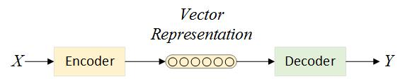
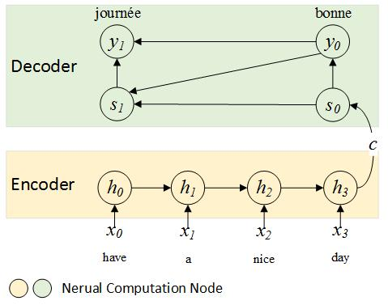
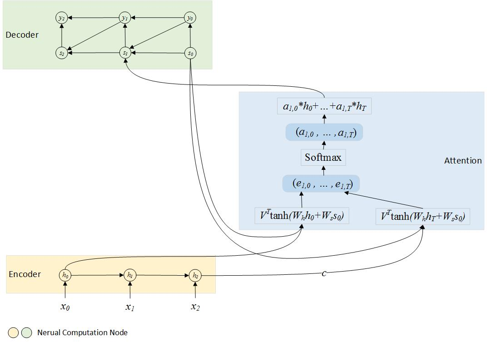

## sequence to sequence & machine translation

[Sequence to sequence model(s2s)](http://arxiv.org/pdf/1406.1078v3.pdf) is a novel neural network architecture that learns to **encode** a variable-length sequence $$X=(x_1,...,x_T)$$ into **a fixed-length vector** representation $$c$$ and to **decode** a given fixed-length vector representation back into a variable-length sequence $$Y=(y_1,...,y_{T'})$$.

Considering $$X$$ is a source language sentence(English), $$Y$$ is the target language sentence(French), this will be a statistical machine translation system(SMT). The idea was firstly proposed in [Cho et al., 2014](https://arxiv.org/abs/1406.1078).

Usually, the encoder is an RNN/LSTM. It reads each symbol of an input sequence $$X$$ sequentially. As it reads each symbol, the hidden state $$h_t$$ of the RNN changes. After reading the end of the sequence (marked by an end-of-sequence symbol), the hidden state of the RNN is a summary $$c$$ of the whole input sequence.

The decoder is another RNN/LSTM which is trained to generate the output sequence, only with some variations. It predicts the next symbol $$y_t$$ given the hidden state $$h_t$$, $$c$$ of the input sequence and previous output $$y_{t-1}$$. $$s_t$$ itself is also conditioned on $$y_{t-1}$$, $$s_{t-1}$$ and $$c$$.

Consider we are building an English to French translator, for the following training sample:

    English:
        have a great day
    French:
        bonne journée

the encoder and decoder RNN are unfolded as following:

### Adding Attention

In the encoder-decoder system, the decoder is solely based on a fixed-length vector $$c$$(last hidden state $$h_T$$ from the encoder). It is expected to encode everything we need to know about the input $$X$$. But it is not true. Although architectures like LSTMs should be able to memorize input far away, in practice, long-range dependencies are still problematic. That is why attention model could help to improve the performance of s2s models.

Attention mechanism is [not a new concept](http://arxiv.org/abs/1109.3737). Now, as a "patch" or "bugfix" for s2s, it is brought back. We no longer expect to encode the full input into a fixed-length vector. Rather, we allow the decoder to “attend” to all  $$h_t$$ at each output generation step.

The following is an attention model implemented as a feed-forward network. When computing $$s_1$$, we will use a weighted combination of all the input states $$h_t$$ instead of the last state $$h_T$$. Here, $$W_h, W_s, V$$ are introduced as parameters of the feed-forward attention model.

The attention model can be jointly trained with encoder and decoder as proposed in a [NMT system implementation](http://arxiv.org/pdf/1409.0473v7.pdf). As the number of parameters growing, it looks complicated and tricky to compute gradients of each parameter. Thanks to powerful toolkits like theano, we only need to define the forward propagation function and let them to do differentiation work automatically. There are also toolkits with well-defined end-to-end system architecture. For example, [groundhog](https://github.com/pascanur/GroundHog) is a well-written theano based s2s toolkit.

### Beyond NMT

s2s is a very general architecture. Besides machine translation, it also covers a variety of machine learning tasks:

 * If $$X$$ is a sentence, $$Y$$ is the part-of-speech tagg, it is a sequence tagger.
 * If $$X$$ is a picture, $$Y$$ the image description, this is an image description generator.
