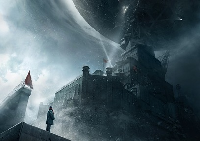

## 十分钟漫游《三体I》

若干年后，叶文洁站在雷达峰上的红岸基地，定会想起1971年秋天那个晴朗的下午。

那天，见关键人员大都已经离开控制室，叶文洁终于按捺不住藏在心里已久的念想：偷偷利用基地的设备验证自己的太阳增益反射理论。根据这一理论，太阳可被用作一个电波放大器，通过它向宇宙中发射电波，功率能比目前地球上全部发射功率之和还要大上亿倍，发现智能文明的机会将大大增加。顾不及组织纪律，她便开始调整发射功率和频段，随后转身将天线对准斜挂西天的太阳，利索地拍下了发射按钮。恐怕连她自己都没有意识到，这一来自地球的啼鸣，以太阳为中心，光速飞向了整个宇宙：

>向收到该信息的世界致以美好的祝愿。

>通过以下信息，你们将对地球文明有一个基本的了解。人类经过漫长的劳动和创造，建立了灿烂的文明，涌现了丰富多彩的文化，并初步了解了自然界和人类社会运行发展的规律，我们珍视这一切。

>但我们的世界仍有很大缺陷，存在着仇恨、偏见和战争，由于生产力和生产关系的矛盾，财富的分布严重不均，相当部分的人类成员生活在贫困和苦难之中。

>人类社会正在努力解决自己面临的各种困难和问题，努力为地球文明创造一个美好的未来。发送该信息的国家所从事的事业就是这种努力的一部分。我们致力于建立一个理想的社会，使每个人类成员的劳动和价值都得到充分的尊重，使所有人的物质和精神需要都得到充分的满足，使地球文明成为一个更加完美的文明。

>我们怀着美好的愿望，期待着与宇宙中其他文明社会建立联系，期待着与你们一起，在广阔的宇宙中创造更加美好的生活。

叶文洁出身知识分子家庭，在来基地之前，她经历了那个最坏的年代。

1967年，父亲叶哲泰在一所大学教物理，不知不觉又毫无悬念地卷入了那场政治灾难。他被拖上批斗台时，头戴高帽，胸前的牌子上醒目地写着他的名字，一个大大的红叉打在对角线。年轻的红卫兵朝他腿上一脚，叶哲泰顺势跪倒在地。革命小将们围成一圈，开始轮番呵斥：

“老实回答，在六二至六五届的基础课中，你是不是擅自加入了大量的相对论内容？！”

“爱因斯坦是反动的学术权威，他有奶便是娘，跑去为美帝国主义造原子弹！要建立起革命的科学，就要打倒以相对论为代表的资产阶级理论黑旗！”

面对台上的丈夫，同为物理教授的妻子紹琳只得疯癫了起来。她接着红卫兵的话头，冲上台去指着丈夫：

“我以前受你欺骗，你用自己那反动的世界观和科学观蒙蔽了我！现在我醒悟了，在革命小将的帮助下，我要站到革命的一边，人民的一边！”

整个会场回荡着“打倒反动学术权威叶哲泰！打倒一切反动学术权威！打倒一切反动学说！”，此起彼伏。叶哲泰终于在红卫兵的皮鞭下倒在了台上。会场很快空了下来，只剩叶文洁一个人站在台下。她咬牙噙泪，那几个杀死父亲的红卫兵恐怕到死都难以忘掉。

两年后，叶文洁被分配到大兴安岭，成为内蒙古生产建设兵团的一名知青。她目睹了大片的林海在这无处燃烧青春的一代手下，化为荒山秃岭。在轰轰烈烈的毁林大潮中，她和进步青年白沐霖一拍即合。白利用工作之便偷偷递给她一本《寂静的春天》。这本书使叶对人类之恶进行了一次决定其一生的理性思考：真正的道德自觉是不可能的，就像不可能拔着自己的头发离开大地，恐怕唯有借助人类之外的力量。

心怀一丝希望，叶文洁为白沐霖代笔，写了一封谏言信。不料，信访信件连同书一起被组织发现了。白沐霖为求自保，将所有责任一股脑推给了叶文洁。叶被带到连部，指导员低头看着地面说道：

“你出身和家庭背景都不好，可我们没把你当外人。针对你脱离群众、不积极要求进步的倾向，我和指导员都多次找你谈过，想帮助你。谁想到，你竟犯了这么严重的错误！我早就看出来，你对‘文化大革命’的抵触情绪是根深蒂固的。”

接着，叶文洁被移送师部，进行进一步审理并关押。眼看就要在高墙大院内含恨度完余生，叶哲泰曾经的一名研究生找到了她。他叫杨卫宁，是红岸工程的负责人。受困于紅岸监听装置的日凌干扰问题，他决定破例冒险启用牢狱之中的叶文洁，希望叶的专业知识能够帮助基地走出困境。

紅岸基地位于大兴安岭深处的雷达峰，几乎与世隔绝。来到这里许久，叶文洁才被告知这一工程的真正目的：搜索可能存在的外星文明，并尝试建立联系和交流。原来，上级领导意识到，外星文明探索领域一旦产生突破，将会产生巨大的技术鸿沟，中国在这一领域必须进行具有前瞻性的战略性投入。

然而二十年过去了，基地一次次向太空广播，却什么都没有听到。研究发现，为了使宇宙中的外星文明接收到我们的电波信号，发射功率应该与一颗中等恒星的辐射功率相当。以现在紅岸的能力，发出的一声声呼唤就像万里长空中的一只蚊子在嗡嗡叫，不会有谁听见的。上级便开始对基地渐渐失去兴趣，投入逐渐减少。

叶文洁却一直默默坚守在紅岸基地。一方面，这个与世隔绝的世界给了她难得的清净；另一方面，她仍对那次偷偷摸摸的发射抱有一丝幻想。一个个静静的午夜，她孤寂地望着示波器。终于，在近九年之后，异样的波形出现了，宇宙给出了回应：

>不要回答！

>不要回答！！

>不要回答！！！

>这个世界收到了你们的信息。

>我是这个世界的一个和平主义者，我首先收到信息是你们文明的幸运，警告你们：不要回答！不要回答！！不要回答！！！

>你们的方向上有千万颗恒星，只要不回答，这个世界就无法定位发射源。

>如果回答，发射源将被定位，你们的行星系将遭到入侵，你们的世界将被占领！

>不要回答！不要回答！！不要回答！！！

之后的四个多小时里，信息源源不断，叶文洁得知了三体世界的存在，了解到那里一次次浴火重生的文明，以及他们星际移民的企图。她没有听从对方的劝阻，决定再次回应：

>到这里来吧，我将帮助你们获得这个世界，我的文明已无力解决自己的问题，需要你们的力量来介入。

不久之后，“文革”的严冬结束了，她和父亲的案件都被彻底地平反。高考也恢复了，受母校邀请，她走下雷达峰，离开红岸基地，去了父亲当年任教的大学教书。政治风气的好转并没有完全愈合她心里的创伤。平日里，她经多方查访，找到了当年打死父亲的那些红卫兵，倒不是要报复他们，只想听听这些凶手的哪怕一点忏悔。可是，当早已不是当年威风模样的红卫兵站在她面前开口时，叶文洁心中刚刚对社会抱有的一丝希望像烈日下的露水般立刻蒸发了：

“最近有一部电影，叫《枫》，不知你看过没有。结尾处，一个大人和一个小孩儿站在死于武斗的红卫兵墓前，那孩子问大人：他们是烈士吗？大人说不是；孩子又问：他们是敌人吗？大人说也不是；孩子再问：那他们是什么？大人说：是历史。听到了吗？是历史！现在是新时期了，谁还会记得我们，拿咱们当回事儿？大家很快就会忘干净的！”

红卫兵的回答在她脑海里不停地回响着……顿时间，将宇宙间更高等的文明引入人类世界，终于成了叶文洁心中坚定不移的信念。

助她一臂之力的是一位叫伊文斯的环保主义者，叶文洁和他是在一次课题选址时偶遇的。伊文斯是一位石油大亨的儿子，父亲的游轮泄露事故让他决定违背父亲的期许，成为一名昆虫生物学家。在他看来，拯救一种鸟或昆虫与拯救人类没有区别，生命是平等的，人类应该信奉“物种共产主义”。最近这段日子，他正致力于保护一种燕子免于灭绝。然而，在费尽心力之后，他低头承认，他想拯救的这种燕子，还有其他的燕子，迟早都会灭绝，只是时间问题。

叶文洁望着远处：“人类文明已经不可能靠自身的力量来改善了。”

“那还能靠谁？难道人类之外还有别的力量？”，伊文斯绝望地反问道。

“有的，有别的力量。”

从叶文洁这里，他得知了地球外文明的存在，希望重新燃起。他马上着手成立第二紅岸基地，并邀请叶文洁做最高统帅。

基地成立在“审判日”号游轮上。他们根据叶文洁给定的频率和方位，和三体世界建立并保持着通信。日复一日，基地吸纳了大量同样对人类持悲观态度的高级知识分子和政界、经济界的精英，组成了一支三体叛军，掀起了“地球三体运动”。随着和三体之间对话的增加，基地成员对那个遥远文明的了解和想象逐渐丰富，三体叛军内部开始出现复杂的派别和分支。

以伊文斯为代表的降临派是最早、最纯粹的一脉，希望借助外星力量毁灭人类。另一些人则在精神上对三体文明产生了宗教感情，他们视水生火热中的三体世界为主，认为地球信徒有责任拯救他们，与之同甘共苦。这些人成立了三体教，成为拯救派。接着又出现了第三个派别：幸存派。与另外两个主流派别相比，幸存派成员都来自较低的社会阶层，他们无意避免那场入侵太阳系的战争，只想在那场终极战争中幸存下来苟且偷生。

根据三体文明发送的信息中对三体世界的描述，地球三体组织开发了一款《三体》游戏，将其作为一种传教手段，招募能理解其深刻含义的社会成员。游戏向玩家展示了一个克隆的三体世界：

那里拥有三颗太阳，行星和太阳的位置变化无常，昼夜交替没有规律，严寒、酷暑说来则来。一本可以预测太阳规律的万年历在三体世界里一直以来梦寐以求。靠在恶劣的乱纪元到来时脱水，规律的恒纪元到来时浸泡，他们有时能幸运地延续文明。但更多时候，变幻莫测的恒纪元和乱纪元带来的是一次次文明的更迭。

三体星系曾有过十二颗行星，在漫长的天文纪年中，一百九十二次文明轮回再生，十一颗行星被三颗太阳所吞噬，仅有一颗幸存。这一轮文明最终在理论上证明三体运动问题不可解，预测行星和太阳的位置是一个幻想，仅剩的一颗行星也随时面临被太阳吞噬的命运。飞出三体星系，在银河系中寻找可以移民的新世界，是唯一的希望。伟大的三体星际舰队，于是起航远征了，目标是四光年外一个只有一颗恒星的星系。

至此，《三体》游戏结束。

一系列的反常事件和地球三体组织的频繁活动，引起了官方的注意。他们顺藤摸瓜，从叶文洁等处得知了伊文斯和第二紅岸基地。于是，来自全球各国的军方成立了一支联合作战队伍。一次作战会议上，联合指挥部明确了下一个作战目标是要夺取“审判日”号上被伊文斯等降临派截留尚未公开的三体信息，作战的前提要保证三体信息能被安全夺取。十分警觉的水上三体叛军令作战方案的制定困难重重。就在这时，一位举止粗鲁的警察大汉捻灭手上的雪茄头：

“在运河两岸立两根柱子，柱子之间平行地扯上许多细丝，间距半米左右，这些细丝是汪教授他们制造出来的那种叫‘飞刃’的纳米材料，只有头发丝百分之一粗细，能吊起大卡车。”

他叫大史，言毕，会场凝固了。

四天后，巴拿马运河盖拉德水道，“审判日”号出现了。轮船静静地驶过，甲板上一个人拿着水龙头在冲洗缆桩。突然那人的身体僵硬了，水龙头从他手里滑落，胶皮水管在不远处断成两截，水花花地喷出来，那人直直地站了几秒钟后倒下了，他的身体在接触甲板的瞬间分成两截，上半部分还在血泊中爬行了一会。随后，发动机发出一声巨响，船尾出现一个破洞，一股浓烟涌出。与此同时，整个“审判日”号散成四十多片薄片。

三天以后，作战组织拿到了多达28G的通信数据，一个真实的三体世界首次展现在叛军之外所有人的面前：

三体文明在首次接收到地球的回应时便产生了警觉。在和第二紅岸基地的通信中，他们发现地球文明具有可怕的加速进化能力。人类从狩猎时代到农业时代，用了十几万地球年时间，最近却仅用了几十个地球年，就进入了信息时代。三体舰队需要经过漫长的航行才能到达地球，到那时，三体舰队在地球文明面前将不堪一击，远征将变为送死。另外，和地球的通信使得三体文明的位置已经暴露，在膨胀的太阳把最后一颗三体行星吞没之前，地球人很可能已经有能力反攻三体文明。

为了消除未来的威胁，三体文明制定了一揽子计划。代号“染色”大肆渲染科学和技术产生的副作用，使公众对科学产生恐惧和厌恶。“神迹”计划力图通过一系列超自然力量的展示，建造一个科学逻辑无法解释的虚假宇宙，摧毁整个科学思想体系。如果说“染色”和“神迹”只能对地球科学发展产生一些干扰，“智子工程”计划则是要彻底窒息地球的科学，使其锁死在现有水平。

三体文明的物理水平让他们具备在微观世界中操控物质十一维结构中九维的能力。他们将一个质子二维展开，铺到天空中，在宏观二维平面上，上千艘飞船同时作业，蚀刻集成电路，打造出了一台超级计算机。软件载入调试完成之后，将二维质子巨膜再收缩回六维。此时，智子的半径已经只有五十个单位。接着，智子二号、三号和四号陆续建成，四个智子组成了一个量子感应阵列。智子各自再次收缩，由六维升至十一维，重新变回质子大小。

智子一号和二号从真空中汲取能量，以接近光速的速度飞向地球。到达之后，第一个任务就是定位人类用于物理学研究的高能加速器，然后潜伏于其中。以地球文明当前的科学水平，对物质深层结构研究所采用的基本方法，是用经过加速的高能粒子撞击选定的靶标粒子，对结果进行分析，以图找出反映物质深层结构的信息。智子会代替靶标粒子接受撞击，有意给出错误和混乱的结果。年复一年，地球物理学家普遍感到，自上个世纪下半叶以来，物理学古典理论中的简洁有力渐渐消失了，理论图像变得越来越复杂、模糊和不确定，实验验证也越来越难，物理学前沿探索似乎遇到了很大的障碍和困难。多位顶尖物理学家因对毕生的物理学研究产生怀疑，先后自杀，叶文洁的女儿杨冬就是其中的一位，她在遗书中写到：

一切的一切都导向这样一个结果：物理学从来就没有存在过，将来也不会存在。我知道自己这样做是不负责任的，但别无选择。

智子除对加速器进行干扰外，还是实施“神迹”的主要技术手段。纳米材料专家汪淼是被选定的一个执行目标。智子像绣花针一样在空间里来回穿梭，在他拍摄的照片上、视网膜上形成一个个诡异的幽灵倒计时，甚至还操纵宇宙背景辐射以莫尔斯码闪现倒计时。眼前的事实让汪淼感到崩溃，他四处寻找物理学界的专家寻求解释，都无疾而终。

三号和四号智子被留在三体星球。量子感应是超距的，四个智子虽然分处宇宙的两端，它们构成的量子阵列依然存在，感应照样可以瞬间传递。把它们留下，在实现三体世界对地球实时监视的同时，也使三体世界能够与地球文明中的异己分子进行实时通讯。

为对这些夺取的信息进行进一步讨论和研究，国际联合作战中心再次召开会议。会前，常伟思将军说：“请同志们注意，我们的会议现在可能已经在智子的监视之下了，以后，任何秘密都将不复存在。”

就在常伟思说完这句话的三秒钟后，三体世界与地球叛军降临派之外的人类进行了第一次交流。作战中心所有人的眼睛都看到了那个信息，就像汪淼看到倒计时一样，信息只闪现了不到两秒钟就消失了：

你们是虫子！

从这以后，他们中断了与地球的通讯，在所有与会者的有生之年，三体世界再也没有发来任何信息。人类陷入了绝望。

会后，大史载着会上认识的两位科学家，沿京石高速向西疾驶，在河北境内的高速公路出口，三人下了车。眼前一片麦田在华北平原上铺展开来，漫天的蝗虫像一层泥巴糊在上面。大史点上一支雪茄，指着面前的麦田说：

“我只想请问二位一个问题：是地球人与三体人的技术水平差距大呢，还是蝗虫与咱们人的技术水平差距大？”

这个问题像一瓢冷水冷不丁泼在两名科学家脸上，他们盯着面前成堆的蝗虫，表情渐渐凝重起来。

“千百年来，人类用尽毒剂，引进天敌，改造基因，用火烧，用水浇，竭尽全力消灭它们。直到现在，仍然胜负未定，它们照样傲行于天地之间。蝗虫从来没被真正战胜过。”

这一天，叶文洁再次登上雷达峰，在当年的天线基座旁发现了一块小小的石碑，上书：

红岸基地原址（1968～1987） 中国科学院 1989.03.21

西边的天际，夕阳在云海中下沉，仿佛在融化，一大片血红在天空中弥漫开来。

“这是人类的落日。”叶文洁轻轻地说。